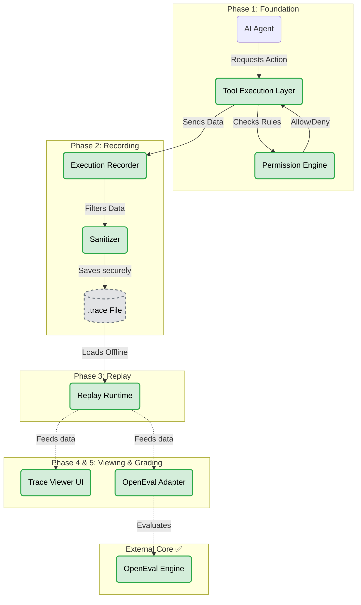

# 🚦 Fixtura Project Status Dashboard

This document provides a birds-eye view of exactly what has been built, what is left to build, and the current status of the project's core requirements.

---

## 🗺️ Visual Architecture & Status

*Green = Done ✅ | Yellow = Needs Integration 🟡 | Red = Not Started ❌ | Grey = Data File 💾*

---

## 🏗️ Phase-by-Phase Breakdown

| Phase | Component | Status | What It Is | Notes / Blockers |
| :--- | :--- | :---: | :--- | :--- |
| **Phase 1** | Tools & Permissions | ✅ **DONE** | 3 basic tools + the gatekeeper. | Hard security boundary established. |
| **Phase 2** | Recorder & Sanitizer | ✅ **DONE** | Logs all actions to `.trace` and scrubs secrets. | Tested directly: planted fake secrets are successfully scrubbed. |
| **Phase 3** | Replay Runtime | ✅ **DONE** | Plays `.trace` files back with zero live calls. | Heavily reviewed. 4 major bugs caught and fixed during review. |
| **Phase 4** | OpenEval Adapter | ✅ **DONE** | Translates `.trace` files to OpenEval's format for grading. | Scenarios and scoring verification complete. |
| **Phase 5** | Trace Viewer UI | ✅ **DONE** | Minimal visual timeline to inspect logs. | HTML output verified. |
| **Phase 6** | End-to-End Test | ✅ **DONE** | Running the whole pipeline (Phases 1-5) in one go. | Fully verified via automated tests. Project is v1. |

---

## 🧪 Release Criteria (The "Is V1 Done?" Checklist)

We have 6 strict tests that must pass before Version 1 can be considered finished. Currently, **6 of 6 are passing.**

| # | Test | Status |
| :---: | :--- | :---: |
| **1** | Recording produces a complete trace file | ✅ **Pass** |
| **2** | Replay reproduces every step with zero live calls | ✅ **Pass** |
| **3** | A blocked tool call is denied *and* still shows up in the trace | ✅ **Pass** |
| **4** | A planted fake secret never ends up in a saved trace file | ✅ **Pass** |
| **5** | OpenEval adapter produces consistent scoring | ✅ **Pass** |
| **6** | A new developer can clone, record, replay, and inspect a trace in under 10 minutes | ✅ **Pass** |

---

## 🚀 What "Done" Looks Like

When this dashboard is completely green, a developer will be able to do this in one sitting:

1. 🏃 **Run** a real agent against safe tools (with permissions checked).
2. 💾 **Get** a `.trace` file (compressed, secrets redacted).
3. ⏪ **Replay** it with zero live calls (exact identical run).
4. 🔍 **Step through** it visually in a tiny UI window.
5. 💯 **Grade it** automatically via OpenEval.

*(At that point, we will put it in the hands of 5-10 real outside developers to test viability before making any business/pricing decisions).*
